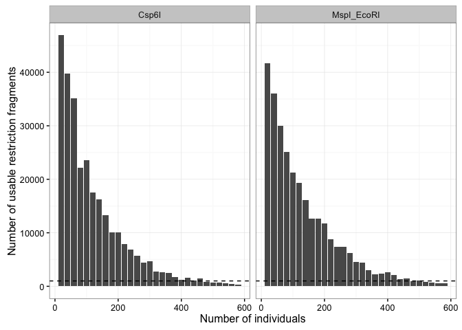
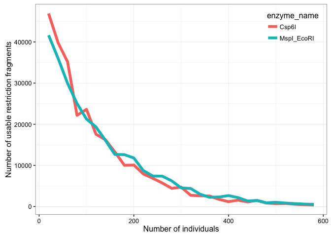
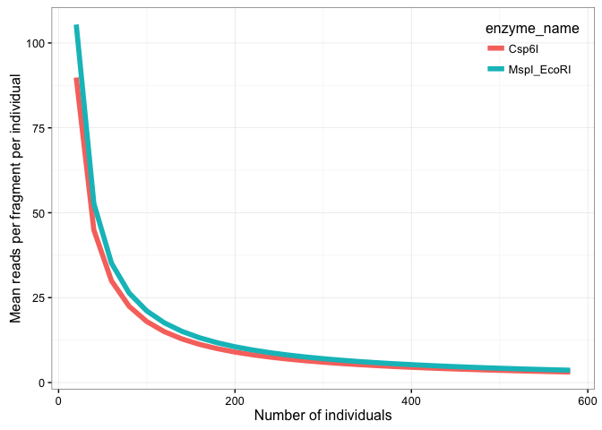
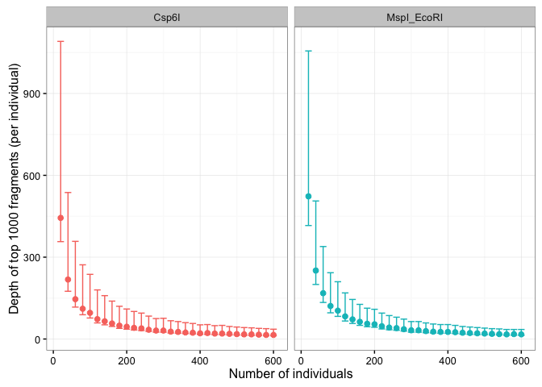
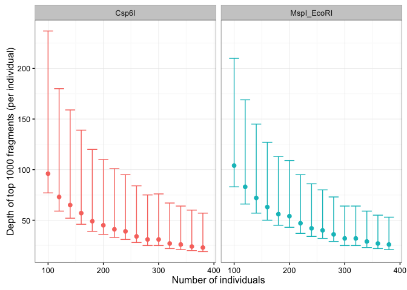

# GBS Study Design
Kieran Samuk  
September 9, 2016  


## Background

### Aims

We want estimates of FST between two *Drosophila psuedoobscura* populations at approximately 1000 sites across the genome. Reduced representation sequencing (GBS/RAD/ddRAD) is a common approach for the scale of genotyping required. Two other labs at Duke have established GBS/ddRAD protocols. The Rausher lab uses a double digest of EcoRI and MspI and the Willis lab uses a single digest of Csp6I.

We would like to know:

1. How many individuals per population we can safely include, given some specified balance between depth and number of sites.
2. How the two existing protocols compare in the above.

To achieve this, I've written a basic simulation of a GBS library prep. This leverages the [SimRAD library](https://cran.r-project.org/web/packages/SimRAD/index.html).

### Simulation

#### Description
The basic form of the simulation is as follows:

- Download and read in a reference genome 
- Read in restriction enzymes (specified in code)
- SimRAD: Digest the reference genome accord to the cut sites of specified enzymes
- SimRAD: Size-select the restriction fragments (300-500bp, can be modified)
- Simulate variable sequencing of fragments (assumes a negative exponential distribution)
- Simulate variable sequencing of individuals (assumes a gaussian distribution, variance estimate obtained from a real GBS library)
- Compute the number of total "usable" fragments (fragments in which 80% of individuals have > 10 reads)
- Compute the mean, min and max number of reads for the top *n* (1000) best sites

#### Parameters
The simulation requires the following parameters (defaults in parentheses):

- A reference genome in FASTA format (none)
- One or two restriction enzymes (none)
- A size range for size selection of fragments (300-500 bp)
- The number of individuals to be simulated (60, note we simulation 20-600 below)
- The expected total number of sequenced reads (Illumina 2000: ~100 000 000 reads) 
- The mean/sd (ratio) of the distribution of sequenced reads per individual (previous GBS library: sd = ~0.4 * mean )
- A cutoff for the minimum number of reads a site must have in order to be considered "useable" (10 reads)
- A cutoff for the minimum proportion of individuals that meet the read cutoff for the site (0.8)
- A target number of "best" sites for which we want to track the mean, min and max reads (1000 sites)

#### Note on polymorphism

The simulation is focused on size-selected restriction fragments (those falling in 300-500bp), not polymorphic sites. I assume its probably a safe bet that there will be at least 1 polymorphic site per ~350bp (0.35%), but I haven't looked at this explicity!

## Simulation Code

First, load required libraries.

```r
library("SimRAD")
library("dplyr")
library("tidyr")
library("ggplot2")
```


Next, download a reference genome (if one does not exist already), and read it in as a list (`ref.DNAseq`).


```r
# download reference genome
genome_url <- "ftp://ftp.flybase.net/genomes/Drosophila_pseudoobscura/dpse_r3.04_FB2016_02/fasta/dpse-all-chromosome-r3.04.fasta.gz"
dir.create("data")
```

```
## Warning in dir.create("data"): 'data' already exists
```

```r
if(!file.exists("data/dpse-all-chromosome-r3.04.fasta.gz")){
	download.file(genome_url, "data/dpse-all-chromosome-r3.04.fasta.gz")
}

# create list of fasta sequences from reference genome
ref_genome <- ref.DNAseq("data/dpse-all-chromosome-r3.04.fasta.gz", subselect.contigs = TRUE, prop.contigs = 1.0)
```


Specify restriction enzymes to be used. Cut sites obtained from Wikipedia.


```r
# restriction enzyme sequences

# enzyme cut sites from:
# https://en.wikipedia.org/wiki/List_of_restriction_enzyme_cutting_sites

# enzyme cut site variable names are coded as follows: 
# 5'--cs_5p1  cs_3p1--3'
# 3'--cs_5p2  cs_3p2-—5'

# Csp6I
#5' ---G   TAC--- 3'
#3' ---CAT   G--- 5'
Csp6I <- list(cs_5p1 = "G", cs_3p1 = "TAC", cs_5p2 = "G", cs_3p2  = "CAT", name = "Csp6I")
	
# MspI
# 5' ---C   CGG--- 3'
# 3' ---GGC   C--- 5'
MspI <- list(cs_5p1 = "C", cs_3p1 = "CGG", cs_5p2 = "C", cs_3p2 = "GGC", name = "MspI")

# EcoRI
# 5' ---G   AATTC--- 3'
# 3' ---CTTAA   G--- 5'
EcoRI <- list(cs_5p1 = "G", cs_3p1 = "AATTC", cs_5p2 = "G", cs_3p2 = "CTTA", name = "EcoRI")
```


The core simulation function.


```r
# function for full library prep simulation

rr_library_prep <- function(reference_genome, enzyme_cut1, enzyme_cut2 = NULL, size_range = c(300, 500), 
                            num_ind = 60, expected_reads = 100000000, expected_sequencing_variance = 0.4, 
                            read_cutoff = 10, ind_cutoff = 0.8, n_top_cuts = 1000){
	
	# perform in silico restriction digest 
	digest <- insilico.digest(reference_genome, enzyme_cut1[1], enzyme_cut1[2], verbose = FALSE)
	
	# perform second restriction digest (if specified)
	if (!is.null(enzyme_cut2)){
	  
		digest <- insilico.digest(digest, enzyme_cut2[1], enzyme_cut2[2], verbose = FALSE)
		enzyme_name <- paste0(enzyme_cut1$name, "_", enzyme_cut2$name)
		
	} else{
	  
		enzyme_name <- enzyme_cut1$name
		
	}
	
	# size selection of fragments
	size_sel <- size.select(digest, size_range[1], size_range[2], verbose = FALSE, graph = FALSE)
	
	# simulate variable sequencing of each fragment
	# assumes an approximate exponential distribution of sequencing depth per fragment
	# tbd : specify fragment sequecning variance function
	all_reads <- rexp(length(size_sel), 1/(expected_reads/length(size_sel)))
	
	# init output df list
	out_df <- list()
	
	# if num_ind is a vector of length > 1
	# iterate over number of individuals and same summary stats
	
	for (i in 1:length(num_ind)){
		
	# expected reads for each individual
	expected_reads_per_ind <- expected_reads/num_ind[i]
	
	# simulate variable sequencing per individual
	# assumes an approximate gaussian distribution of sequencing per individual
	# tbd: specify individual sequencing variance function
	prop_reads <- rnorm(num_ind[i], mean = expected_reads_per_ind, 
	                    sd = expected_reads_per_ind * expected_sequencing_variance) 
	prop_reads <- (prop_reads / (expected_reads_per_ind)) / num_ind[i]
	prop_reads <- ifelse(prop_reads < 0, 0, prop_reads)
	
	# assign reads to individuals
	assigned_reads <- lapply(prop_reads, function(x) round(all_reads * x)) %>% data.frame
	
	# create data frame of assigned reads
	names(assigned_reads) <- paste0("ind_", 1:num_ind[i])
	assigned_reads <- data.frame(fragment = 1:length(all_reads), assigned_reads) %>%
		gather(-fragment, key = "ind", value = "frag_count")
	
	# calculate the number of fragments that pass:
	# 1: the depth threshold (reads per fragment)
	# 2: the individual representation threshold (prop individuals that pass #1)
	prop_fragments_useable <- assigned_reads %>%
		mutate(frag_count_acceptable = frag_count > read_cutoff) %>%
		group_by(fragment) %>%
		summarise(prop_ind_acceptable = mean(frag_count_acceptable)) %>%
		mutate(ind_count_acceptable = prop_ind_acceptable > ind_cutoff) %>%
		summarise(prop_frags_usable = mean(ind_count_acceptable)) %>%
		as.numeric
	
	# depth of the top 1000 fragments
	top_n <- assigned_reads %>%
		group_by(fragment) %>%
		summarise(mean_depth = mean(frag_count)) %>%
		arrange(desc(mean_depth)) %>%
		select(mean_depth) %>%
		.[1:n_top_cuts,] %>%
		unlist
	
	# generate a single-row dataframe as output
	out_df[[i]] <- data.frame(enzyme_name = enzyme_name, num_ind = num_ind[i], number_of_fragments = length(size_sel), mean_reads_per_fragment_per_ind = (expected_reads/length(size_sel))/num_ind[i], prop_fragments_useable = prop_fragments_useable, number_fragments_usable = prop_fragments_useable*length(size_sel), mean_top_n_fragments = round(mean(top_n)), min_top_n_fragments = round(min(top_n)), max_top_n_fragments = round(max(top_n)))
	
	}
	
	out_df
	
}
```


Perform the actual simulation and bind results into dataframe:


```r
# if simulated preps exist, read them in, otherwise:
# perform in silico preps for csp6I and ecoRI + mspI
# varying number of individuals

if(!file.exists("data/simulated_preps.txt")){
  
  ind_list <- seq(20, 600, by = 20)

  csp_preps <- rr_library_prep(num_ind = ind_list, reference_genome = ref_genome, enzyme_cut1 = Csp6I)
  eco_msp_preps <- rr_library_prep(num_ind = ind_list, reference_genome = ref_genome, enzyme_cut1 = MspI, enzyme_cut2 = EcoRI)

  # for testing purposes only, not run
  # eco_preps <- rr_library_prep(num_ind = ind_list, reference_genome = ref_genome, enzyme_cut1 = EcoRI)

  prep_df <- rbind(do.call("rbind", csp_preps), do.call("rbind", eco_msp_preps))
  
  write.table(prep_df, "data/simulated_preps.txt")
  
} else{
  
  prep_df <- read.table("data/simulated_preps.txt", h = T)

}
```

## Results

### Usable restriction fragments

Each bar depicts the number of fragments that on average > 10 reads in 80% of the individuals. Both techniques result in a similar(ish) maxmimum number of fragments, and have a similar rate of deline when adding additional individuals. The dotted line shows y = 1000 usable fragments. According to the simulation, we can sequence **up to ~400 individuals while still recovering 1000 usable sites**. 




Here are the two techniques overlaid directly. Both techniques result in very similar outcomes.




### Mean reads per fragment/individual

If we just look at the mean reads per fragment, per individual, the pattern is the same.




### Mean depth of top 1000 fragments

If we examine the sequencing depth per fragment per individual for the top 1000 most numerous fragments, both techniques again generate similar results. Plots show min, mean, max.





If we zoom in on the range of 100 - 300 individuals, we can see that we can very safely recover 1000 high-depth (min 35 reads/fragment) loci when including 150-200 individuals.




## Conclusion

Both the Willis and Rausher restriction digests would readily allow us to get 1000 SNPs across the genome. 

* Sequencing the minimum number of individuals (20 and 20) results in ~40000 usable fragments. 
* If we truly *only* wanted ~1000 sites, could sequence up to 400 individuals.
* If we wanted to be conservative, we could sequence 200 individuals. This will give us a set of 1000 high-depth (~35x / individual / site) sites, and (in theory) ~10000 total usable sites.
